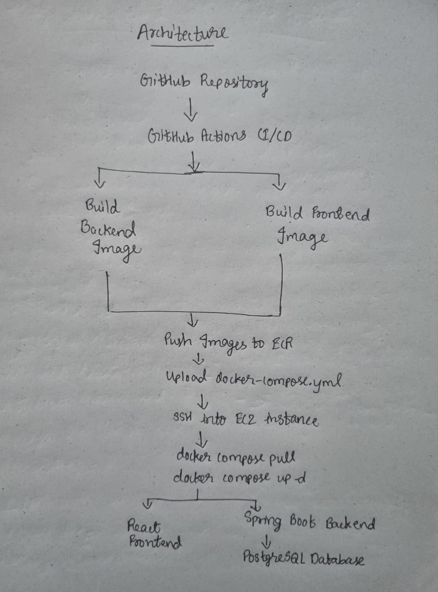

# Warranty and Purchase Order Management System (WPOMS)

## Project Overview

The Warranty and Purchase Order Management System (WPOMS) is a web-based application that simplifies the management of purchase orders and product warranties through a centralized platform. It is built using React, Spring Boot, and PostgreSQL with automated deployment using Docker, GitHub Actions, and AWS.

## Architecture

## How to Run Locally

- Clone the repository.

git clone <repository-url>
cd <repository-folder>

- Start the application.

docker compose up --build

- Access:
  - Frontend: http://localhost:3000
  - Backend: http://localhost:8081

- Stop the application.

docker compose down

## How the CI/CD Pipeline Works

- Push code to the master branch.
- GitHub Actions builds the backend JAR.
- Docker images for frontend and backend are created.
- Images are pushed to Amazon ECR with a unique image tag.
- docker-compose.yml is uploaded to Amazon S3.
- GitHub Actions connects to EC2 using SSH.
- EC2 pulls the latest images and starts containers using Docker Compose.
- A health check verifies that the application is running.

## How to Debug a Failed Pipeline

- Check the failed step in GitHub Actions logs.
- Verify running containers:

docker ps

- Check application logs:

docker compose logs backend
docker compose logs frontend

- Verify application status:

curl http://<EC2-PUBLIC-IP>

## Live URL

http://15.207.204.217:3000
